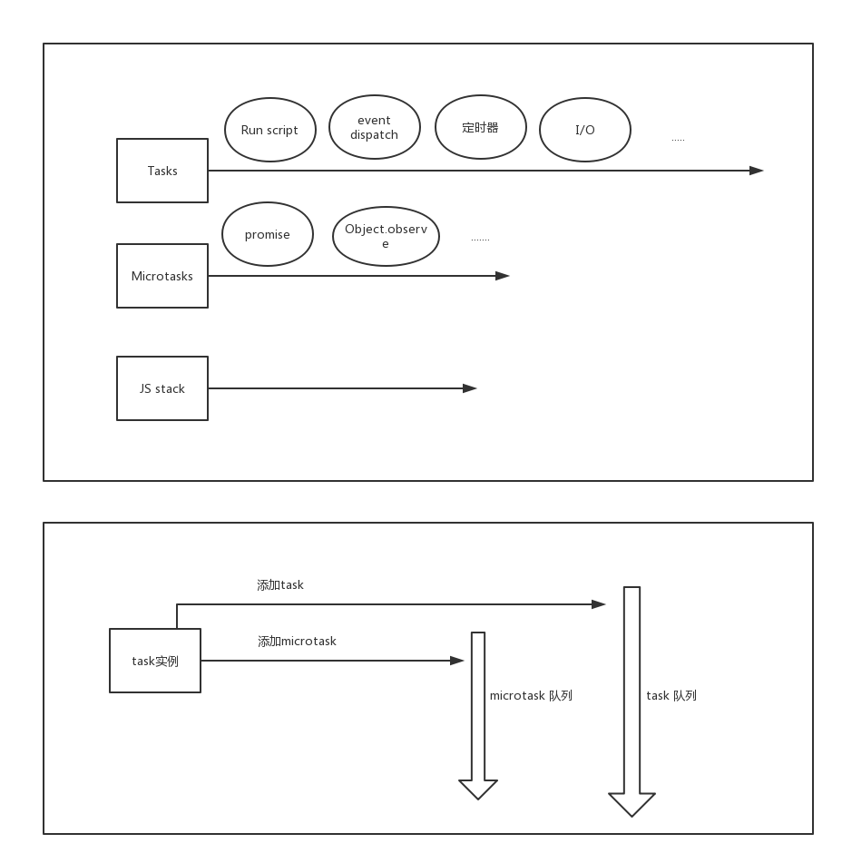

# event loop

## 关键字

1. task 队列(macrotask)
2. microtask 队列
3. js Stack (执行栈)

## 执行顺序

1. 当前`task` 执行完毕 -> 清空`microtask`队列 -> 下一个`task` (新的循环开始)
2. 如果当前的`js stack`为空,则直接清空`microtask`队列,然后继续执行当前`task`完毕 -> 清空`microtask`队列(如果需要) -> 下一个`task` (新循环开始)
3. 执行`task`的过程中,如果创建了新的`task`或`microtask`,则将其放入相应队列后继续执行当前`task`

## 理解图

## 一些思考

1. 本质上类似任务调度系统,目的是尽可能的提高 js 执行引擎的效率

## 其他

不同浏览器的具体效果不一致.

## 参考

1. [Tasks, microtasks, queues and schedules](https://jakearchibald.com/2015/tasks-microtasks-queues-and-schedules/)
2. [great talk at JSConf on the event loop](https://www.youtube.com/watch?v=8aGhZQkoFbQ)